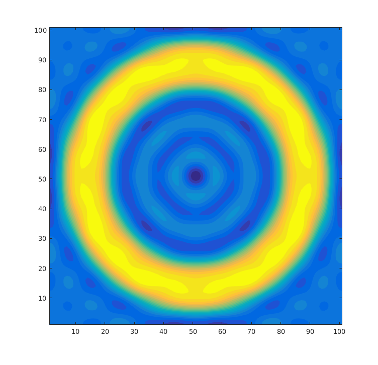

The following example creates two contained circle patterns in the layer of `SiBottom`, resulting in a cylindrical shell made of vacuum.

```lua
s = SimulationPattern.new();
s:SetLattice(1e-7, 1e-7, 90);
s:SetNumOfG(250);
--s:OptSetLatticeTruncation("Parallelogramic")
s:AddMaterial("Si", "Si.txt");
s:AddMaterial("Vacuum", "Vacuum.txt");
s:AddLayer("SiBottom", 0, "Si");
s:SetLayerPatternCircle("SiBottom", "Vacuum", {50e-9, 50e-9}, 45e-9)
s:SetLayerPatternCircle("SiBottom", "Si", {50e-9, 50e-9}, 30e-9)
s:AddLayer("VacGap", 1e-7, "Vacuum");
s:AddLayer("SiTop", 0, "Si");
s:SetSourceLayer("SiBottom");
s:SetProbeLayer("VacGap");

s:OptPrintIntermediate();
s:SetKxIntegralSym(100);
s:SetKyIntegralSym(100);
s:InitSimulation();
s:OutputSysInfo();
s:IntegrateKxKy();
```
The output from the function `GetLayerPatternRealization` results in the following figure

The resulting $\Phi(\omega)$ is