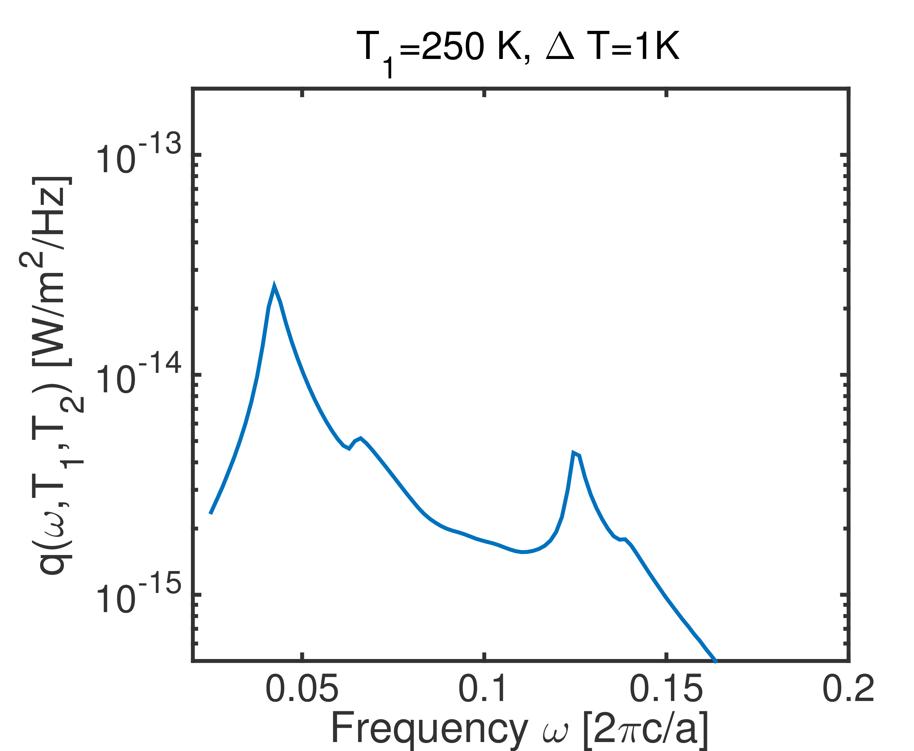

This code can produce the result in Fig. 3 (a) red curve in [Phys. Rev. B 93, 155403, 2016](https://journals.aps.org/prb/abstract/10.1103/PhysRevB.93.155403).
```lua
s = SimulationGrating.new()
s:SetPeriodicity(1e-6);
s:AddMaterial("Au", "fullGold.txt");
s:AddMaterial("Vacuum", "fullVacuum.txt");

s:AddLayer("BottomAir", 0, "Vacuum");
s:AddLayer("GoldSubstrateBottom", 0.5e-6, "Au");
s:AddLayer("GoldGratingBottom", 5e-6,"Au");
s:SetLayerPatternGrating("GoldGratingBottom", "Vacuum", 0.5e-6, 0.2e-6);

s:AddLayer("VacGap", 1e-6, "Vacuum");
s:AddLayerCopy("GoldGratingTop", "GoldGratingBottom");
s:AddLayerCopy("GoldSubstrateTop", "GoldSubstrateBottom");
s:AddLayerCopy("TopAir", "BottomAir");

s:SetSourceLayer("GoldSubstrateBottom");
s:SetSourceLayer("GoldGratingBottom");
s:SetProbeLayer("VacGap");
s:OutputSysInfo();

s:OptPrintIntermediate();
s:SetThread(4);
s:SetGx(50);
s:SetKxIntegralSym(500);
s:SetKyIntegralSym(200, 5);
s:BuildRCWA();
s:IntegrateKxKy();
--print(string.format("%e", s:GetPhiAtKxKy(0, 0, 0)));
phi = s:GetPhi();
omega = s:GetOmega();
for i = 1,s:GetNumOfOmega(), 1 do
  print(string.format("%e", omega[i]).."\t"..string.format("%e", phi[i]));
end
```
The curve produced by this code is
