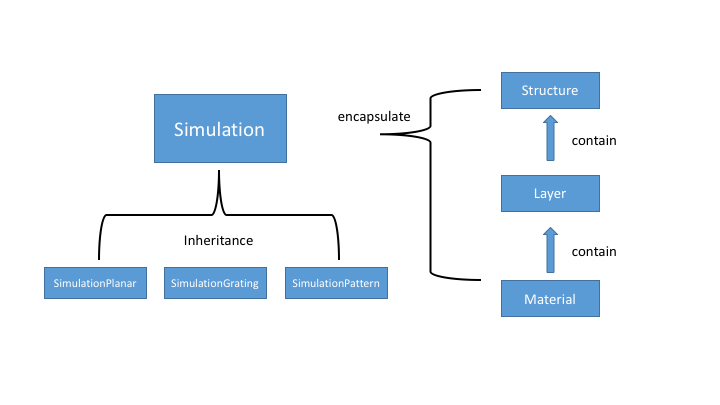

The source code of MESH is in `src/` folder, which consists of the following files and folders:

* `arma/`: the folder contains all the headers from [armadillo](http://arma.sourceforge.net/).
* `luawrapper/`: the Lua wrapper for C++ classes and MPI.
* `mathlib/`: some mathematical functions such as Bessel functions, and Gauss-legendre integral method.
* `utility/`: templates for smart points as well as exception handling.
* `Cubature.c`: a fast adaptive integration method for high dimensional functions, adoptted from [the original code](http://ab-initio.mit.edu/wiki/index.php/Cubature).
* `Fmm.cpp`: file computing the Fourier transform for different geometries.
* `Gsel.cpp`: file containing functions to select G vectors.
* `Rcwa.cpp`: file computing the RCWA and Poynting vector.
* `System.cpp`: file containing material, layer and structure classes and their methods.
* `Mesh.cpp`: file containing different types of simulations and C++ API.
* `main_lua.cpp`: file implementing Lua API.

The class structure is illustrated in the following figure

There are few features that need to be implemented in MESH:

* A correct and fast implementation of Fourier transform over dielectric functions.
* Improved ways of doing $k_x$ and $k_y$ integral other than the current naive summation method.
* Computing more physical quantities, such as energy density and Casimir force.